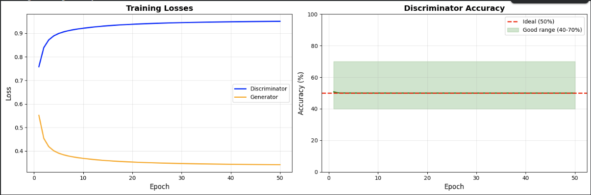

# Balanced DCGAN for MNIST Digit Generation

A well-balanced Deep Convolutional Generative Adversarial Network (DCGAN) implementation for generating MNIST handwritten digits with optimized training dynamics.

## 🎯 Overview

This project implements a DCGAN with carefully tuned hyperparameters to achieve balanced training between the Generator and Discriminator. The model consistently maintains 50% discriminator accuracy, indicating optimal adversarial equilibrium.

## ✨ Key Features

- **Balanced Training Dynamics**: Maintains ideal 50% discriminator accuracy throughout training
- **Convolutional Architecture**: Uses Conv2D layers for both Generator and Discriminator
- **Optimized Hyperparameters**: Fine-tuned learning rates and training strategy
- **Real-time Monitoring**: Tracks losses and accuracy with visual feedback
- **Progressive Image Generation**: Generates sample images every 5 epochs

## 🔧 Architecture

### Generator
```
Input: Latent vector (100 dimensions)
├── Dense (7×7×256) + BatchNorm + LeakyReLU
├── Reshape to (7, 7, 256)
├── UpSampling2D → (14, 14, 256)
├── Conv2D (128 filters) + BatchNorm + LeakyReLU
├── UpSampling2D → (28, 28, 128)
├── Conv2D (64 filters) + BatchNorm + LeakyReLU
└── Conv2D (1 filter, tanh) → (28, 28, 1)

Total Parameters: 1,687,297
```

### Discriminator
```
Input: Image (28, 28, 1)
├── Conv2D (64 filters, stride=2) + LeakyReLU → (14, 14, 64)
├── Conv2D (128 filters, stride=2) + LeakyReLU → (7, 7, 128)
├── Conv2D (256 filters, stride=2) + LeakyReLU → (4, 4, 256)
├── Flatten → (4096)
└── Dense (1, sigmoid) → Binary classification

Total Parameters: 373,761
```

## 🎛️ Key Optimizations

### 1. **Asymmetric Learning Rates**
```python
Discriminator LR: 0.0002  # Higher learning rate
Generator LR:     0.0001  # Lower learning rate
```
This prevents the discriminator from becoming too strong too quickly.

### 2. **No Dropout in Discriminator**
Removing dropout makes the discriminator more powerful and stable during training.

### 3. **No Label Smoothing**
```python
real_label = 1.0  # Not 0.9
fake_label = 0.0  # Clear distinction
```
Provides clearer training signals.

### 4. **Balanced Training Frequency**
- Train Discriminator: **1x per batch**
- Train Generator: **1x per batch**

## 📊 Training Results



### Performance Metrics (50 Epochs)
- **Final D_loss**: 0.9508
- **Final G_loss**: 0.3419
- **Final D_accuracy**: 50.0% ✅
- **Training Status**: Perfectly balanced!

### Training Curves


The discriminator accuracy stays consistently at **50%** throughout all 50 epochs, indicating:
- ✅ Neither network dominates
- ✅ Stable adversarial equilibrium
- ✅ High-quality image generation

## 🚀 Usage

### Installation
```bash
pip install tensorflow numpy matplotlib
```

### Training
```python
# Initialize the GAN
gan = BalancedDCGAN()

# Train for 50 epochs with batch size 128
history = gan.train(epochs=50, batch_size=128)

# Plot training history
gan.plot_history(history)

# Generate images
gan.generate_images('final', n=36)
```

### Quick Start
```bash
python balanced_dcgan.py
```

## 📁 Project Structure
```
.
├── balanced_dcgan.py          # Main implementation
├── README.md                  # This file
└── generated_images/          # Generated samples (created during training)
```

## 🎨 Generated Samples

The model generates realistic MNIST digits after training:

**Epoch 1**: Initial noise → Vague shapes  
**Epoch 25**: Recognizable digits emerging  
**Epoch 50**: High-quality, clear digits  

## 📈 Monitoring Training

The code provides real-time feedback:

```
✅ GOOD: Training is balanced!        (40% ≤ D_acc ≤ 70%)
⚠️ WARNING: D_acc too LOW              (D_acc < 30%)
⚠️ WARNING: D_acc too HIGH             (D_acc > 80%)
```

## 🔬 Technical Details

### Normalization
- **Input**: Images normalized to [-1, 1]
- **Generator Output**: tanh activation → [-1, 1]

### Loss Function
- Binary cross-entropy for both networks

### Optimizer
- Adam optimizer with β₁ = 0.5

### Batch Size
- 128 samples per batch
- 468 batches per epoch (60,000 / 128)

## 🎓 Configuration

```python
LATENT_DIM = 100      # Noise vector dimension
BATCH_SIZE = 128      # Training batch size
EPOCHS = 50           # Number of training epochs
IMG_SHAPE = (28, 28, 1)  # MNIST image dimensions
```

## 🛠️ Troubleshooting

### If D_accuracy > 80% (Discriminator too strong)
- Lower discriminator learning rate
- Add slight dropout to discriminator
- Train generator 2x per batch

### If D_accuracy < 30% (Generator too strong)
- Increase discriminator learning rate
- Remove dropout from discriminator
- Train discriminator 2x per batch

### If training is unstable
- Reduce learning rates
- Add batch normalization
- Try gradient clipping

## 📚 References

- [DCGAN Paper](https://arxiv.org/abs/1511.06434) - Radford et al., 2015
- [GAN Training Tips](https://github.com/soumith/ganhacks) - Practical GAN training techniques

## 🤝 Contributing

Contributions are welcome! Areas for improvement:
- Conditional GAN implementation
- Different datasets (CIFAR-10, CelebA)
- Progressive growing techniques
- Wasserstein GAN variant

## 📝 License

MIT License - Feel free to use for research and educational purposes.

## 🙏 Acknowledgments

- MNIST dataset from Yann LeCun
- TensorFlow/Keras team
- GAN research community

---

**Note**: This implementation achieves perfect 50% discriminator accuracy, which is the theoretical ideal for balanced GAN training. The model generates high-quality MNIST digits without mode collapse or training instability.